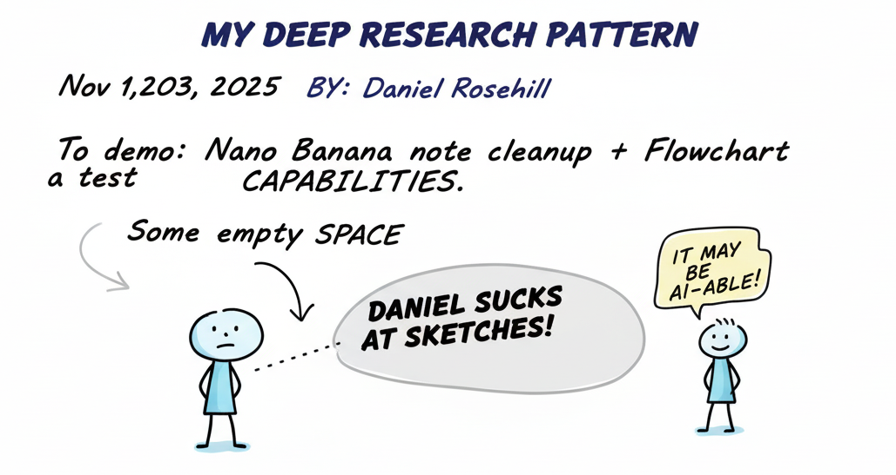
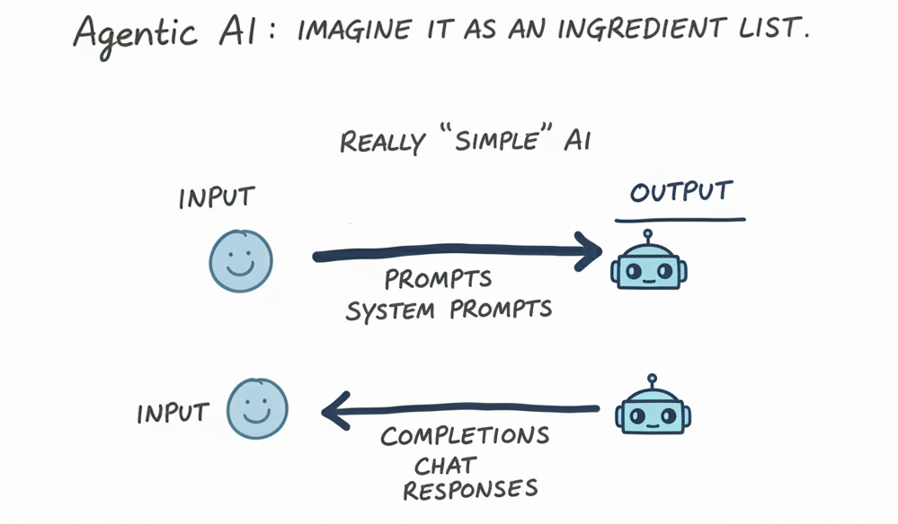
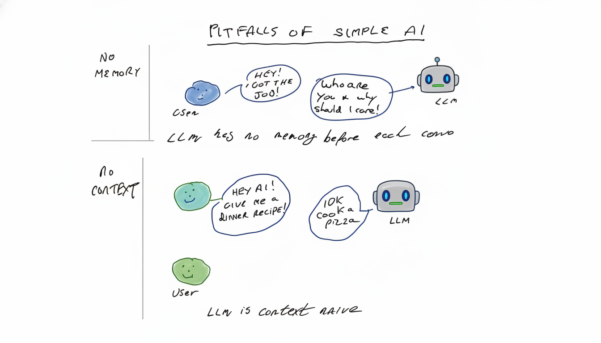
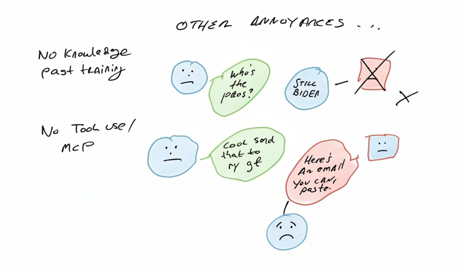
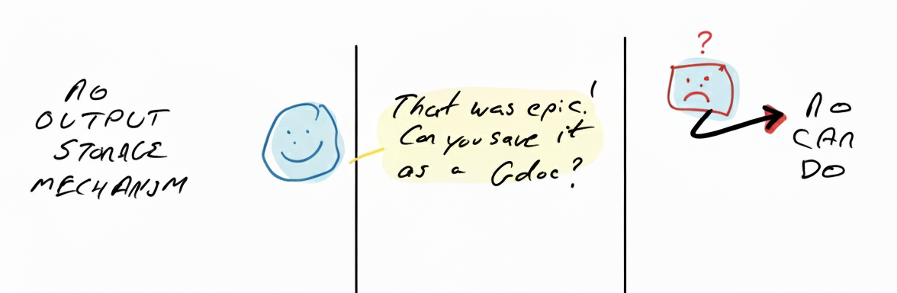
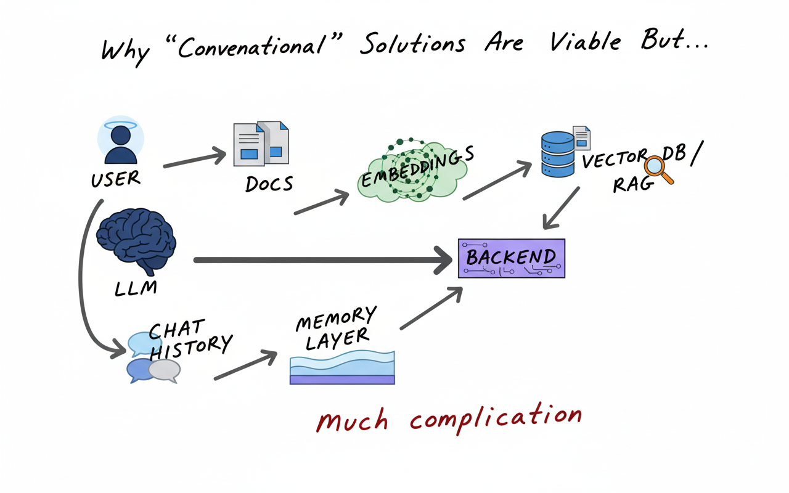
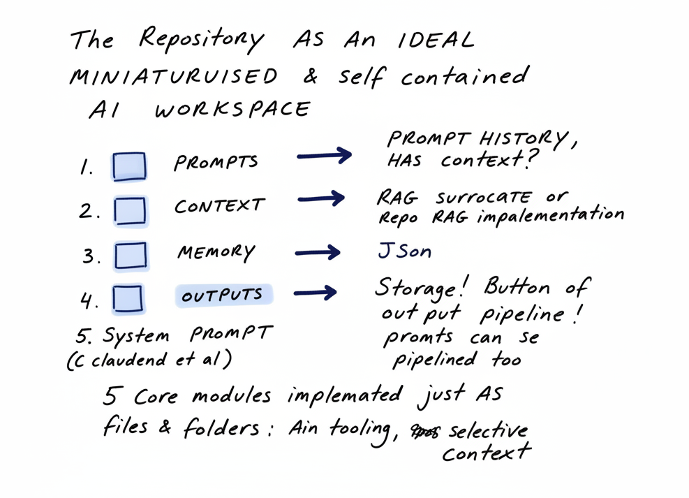
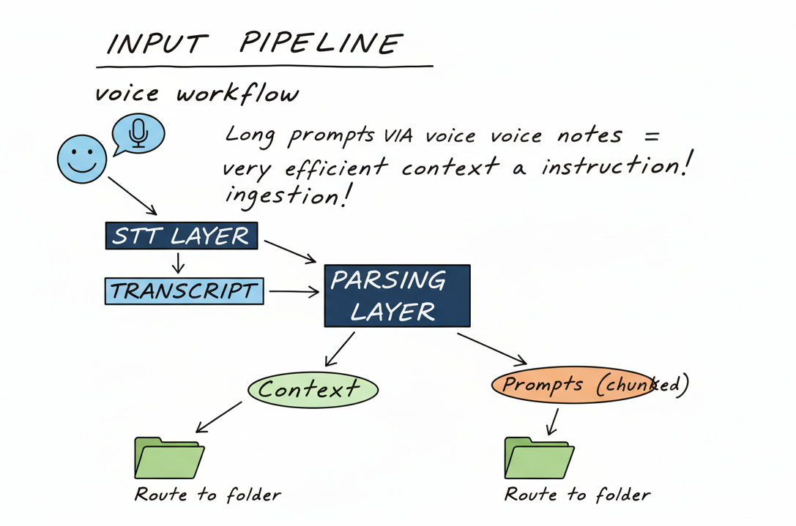
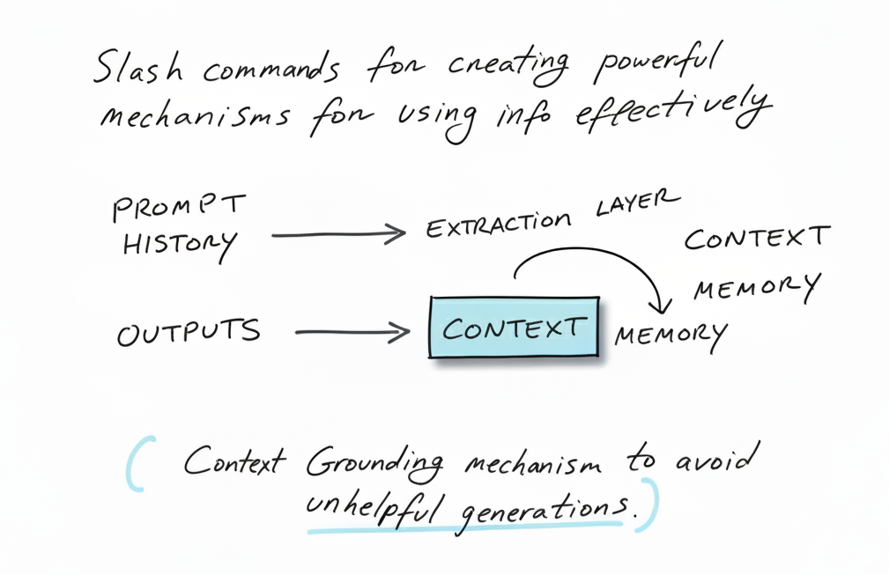
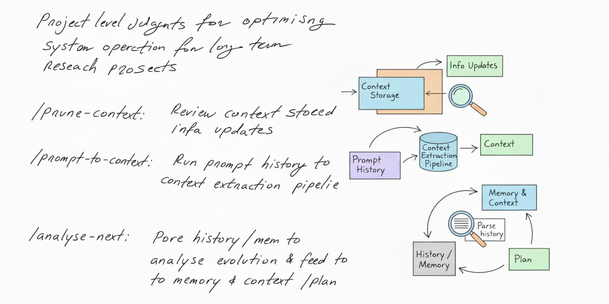

# Claude Deep Research Model

## Concept Notes

Listen to the concept discussion podcast: [Spotify Episode](https://open.spotify.com/episode/0AuchKOm47XdKSGDePfEJq?si=4Q2Gl12sQtej6eT1oo9RDQ)

## Model Base

The core model components are located in the `model-base/` directory:

- **`context/`** - Context files and background information for the model
- **`notes/`** - Development notes and documentation
- **`outputs/`** - Generated outputs and results
- **`pipeline/`** - Processing pipeline configurations
- **`prompts/`** - System prompts and prompt templates
- **`scratchpad/`** - Working area for experiments and drafts
- **`slash-commands/`** - Custom slash commands for Claude Code integration

## The Model

Diagrams: Nano Banana from my notes (minor pseudotext)

---

---

---

---

---

---

---

---

---

---

